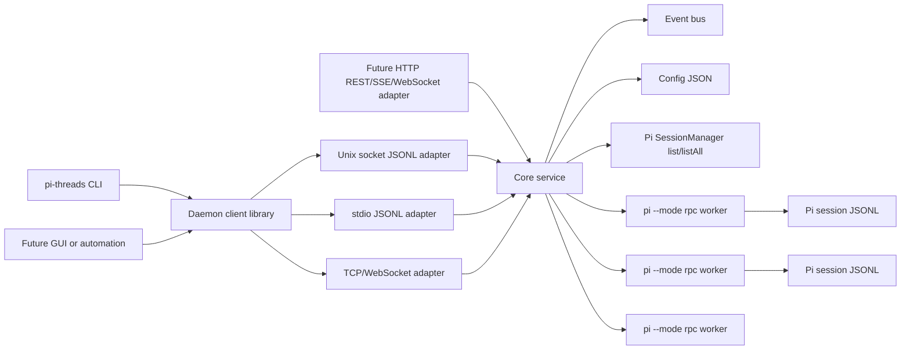
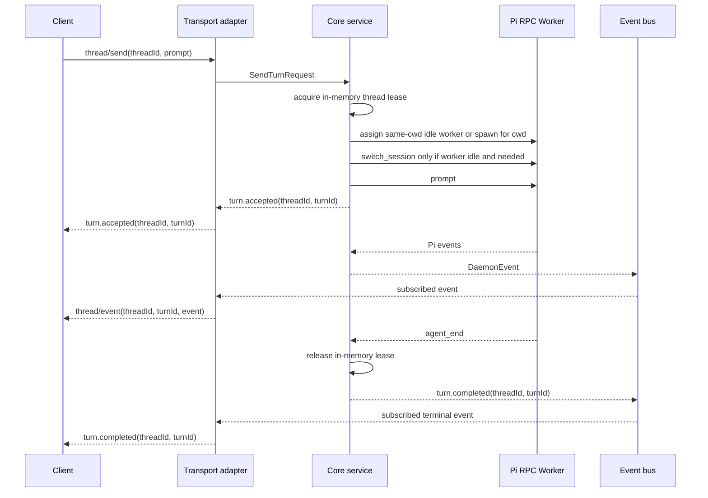

# Pi Threads Daemon

## Overview

Build `pi-threads`, a full-featured Pi threads daemon/tool that exposes a Codex app-server style, thread-aware control surface while internally supervising a pool of single-session `pi --mode rpc` worker processes. Pi session ids/files are the durable thread catalog and transcript source of truth. The daemon owns only live routing, worker assignment, subscriptions, event multiplexing, and transport security. Pi RPC workers remain the execution engine for one active session each.

The design should keep the daemon's service/domain logic independent from CLI presentation and wire transports. Unix socket JSONL, stdio JSONL, TCP/WebSocket, and any future HTTP API are adapters over the same core service methods and event bus.

The recommended user-facing name is `pi-threads`. The primary command is `pi-threads`, with daemon lifecycle commands such as `pi-threads daemon start`.

`pi-threads` is planned as a new separate repo/tool. Pi is an external runtime/protocol dependency and reference workspace for this design, not the implementation home for the daemon. This feature does not modify Pi and must not assume Pi will be changed to conform to `pi-threads` requirements.

## Motivation

Pi already has a useful headless mode, but `--mode rpc` is scoped to one current session per process. Users who want `codex-threads`-style coordination need a daemon layer that can run, inspect, steer, abort, and resume multiple Pi sessions without modifying Pi's core runtime into a native multi-session server.

## Scope

In scope:

- Add a new separate `pi-threads` daemon/tool surface with Unix socket, stdio, and secured TCP transports.
- Provide a `pi-threads` CLI with Codex-like commands where Pi has a native equivalent: list/search/show/messages/new/send/steer/abort/status/fork/name/settings/models/usage.
- Expose Pi-specific capabilities available through current Pi RPC/session APIs: extension UI, bash execution/abort, compaction, HTML export, provider/model attribution, command listing, auto-compaction/auto-retry controls, and context/session stats.
- Use `pi --mode rpc` workers internally, one active worker per active thread.
- Define target daemon protocol, data model, worker lifecycle, auth/security, and compatibility requirements for the existing Pi RPC worker protocol.
- Reuse Pi protocol/session/RPC types through published Pi exports, generated/copied type artifacts, or a deliberate shared package if needed.

Out of scope:

- Implementing the daemon, CLI, or tests in this design step.
- Implementing `pi-threads` inside the Pi repo.
- Modifying Pi. `pi-threads` adapts to the supported external Pi versions; this design does not plan or request Pi changes.
- Replacing the existing TUI, print, JSON, or `--mode rpc` entry points.
- Exposing worker `switch_session` as a public client operation.
- Persisting daemon-owned thread metadata, archive/tag state, audit logs, durable event replay, or a search database.
- Providing archive/unarchive unless a supported external Pi release already exposes native session archive support; adding daemon-only archive metadata is out of scope.
- Supporting compatibility with an older daemon protocol; this is a new surface.

## Contract

Architecture:

- Implementation target is TypeScript, Node-compatible, matching Pi's runtime and allowing reuse of Pi protocol types, session shapes, and RPC client helpers without moving the daemon into the Pi repo.
- Type/protocol reuse options are, in order of preference: consume stable published Pi exports; generate or copy versioned type artifacts into the `pi-threads` repo; introduce a deliberate shared package only if the contract becomes broad enough to justify it.
- Current Pi exports cover the main RPC command/response/state/client and `SessionManager` surfaces. Extension-UI and slash-command type shapes may need to use the generated/copied fallback if they are not exported by the supported Pi package version.
- Pin Pi as an explicit runtime/protocol dependency. `pi-threads` releases should declare a tested Pi version range, record the worker `pi --version` in worker state, fail startup or worker assignment for unsupported protocol versions, and include a small compatibility matrix in release notes.
- Plan Bun support from the start: avoid Node-only assumptions in core code where practical, keep Bun-compatible build/test smoke coverage, and add eventual Bun-compiled standalone binaries/releases for `pi-threads`.
- Clients talk to the daemon using Pi session ids as thread ids. A direct session file path may be accepted as an explicit debug/load handle, but the stable CLI/API id is the Pi session id.
- The daemon talks to single-session `pi --mode rpc` workers.
- Active threads are pinned to workers. Idle workers may be reused.
- Workers have cwd affinity because Pi `new_session` creates in the worker process cwd and has no cwd parameter. `thread/start` for cwd X must use an idle worker already rooted at X or spawn a new worker in X. Idle workers are reusable for new sessions only within the same cwd. `switch_session` may re-home an idle worker only by loading an existing session file, whose cwd then becomes the worker's effective session cwd.
- Worker pool limits and idle TTL are evaluated against both global limits and cwd-local demand. A prewarmed worker is useful only for the cwd it was spawned in unless it is later switched to an existing session.
- A Pi session file has at most one active daemon writer lease.
- Cross-process safety is not provided by current Pi session files alone. `pi-threads` should use Pi's normal session store so ordinary Pi sessions are discoverable and loadable, then enforce only an in-memory single-writer lease among daemon-owned workers. Direct `pi` use of the same session while the daemon is writing remains a best-effort safety problem: the daemon must check session mtime/size/last-entry before worker assignment and before each write-producing command, then refuse with `externalWriterDetected` if the file changed. That check has a TOCTOU window because Pi is an external app and does not share a lock with `pi-threads`.
- `switch_session` is internal to the daemon and only allowed on idle workers.

Layering:

- Core service/domain layer owns the Pi session catalog view, scheduler, worker pool, worker leases, event bus, in-memory active state, authz decisions, and Pi RPC worker adaptation.
- Core methods use protocol-neutral request/response types such as `StartThreadRequest`, `SendTurnRequest`, `ThreadStatus`, `ThreadMessages`, `WorkerStatus`, and `DaemonEvent`.
- Core methods do not parse CLI flags, render human output, frame JSONL, inspect HTTP headers, or know whether a caller came from Unix socket, stdio, TCP, or future HTTP.
- Transport adapters authenticate the caller, decode a wire request into a core request, call the service, encode the service response, and subscribe/unsubscribe to the shared event bus.
- CLI code parses arguments, resolves config/endpoint/auth options, invokes a daemon client API, and formats human, JSON, or NDJSON output. It does not implement scheduling, session catalog lookup, worker management, or command-specific daemon behavior.
- A shared client library should expose the same high-level operations used by the CLI and tests, so future GUI, HTTP gateway, or automation clients do not copy CLI logic.
- Storage is not a daemon metadata database. The baseline design discovers regular Pi sessions directly through Pi's published `SessionManager.list` / `SessionManager.listAll` APIs and keeps live worker assignments in memory. Persistent `pi-threads` state is limited to a config JSON file. No SQLite, search index, token store, audit log, durable event replay store, archive/tag store, or daemon-owned thread registry is part of the core design.

Transports:

- Unix socket is the default local long-lived transport. Use JSON-RPC 2.0 over strict LF-delimited JSONL.
- stdio uses the same JSON-RPC 2.0 over strict LF-delimited JSONL for embedding, tests, and parent-owned daemon processes.
- TCP is opt-in. Prefer WebSocket JSON-RPC over TLS. Raw TCP JSONL is local/debug only and disabled by default.
- TCP binds to `127.0.0.1` by default. Non-loopback TCP requires TLS and bearer token auth. mTLS is supported for stronger deployments.
- TCP auth uses static bearer tokens supplied by config or environment variables. WebSocket TCP validates `Origin` and never uses cookie or ambient browser auth. Token mint/list/revoke is out of scope; use config/env rotation.
- Future HTTP should be an adapter over the same core service methods. Use REST-style resources for request/response operations, SSE or WebSocket for events, bearer/mTLS auth equivalent to TCP, and the same error taxonomy.

Daemon protocol:

- Request: `{ "jsonrpc": "2.0", "id": "...", "method": "thread/send", "params": {...} }`.
- Success: `{ "jsonrpc": "2.0", "id": "...", "result": {...} }`.
- Error: `{ "jsonrpc": "2.0", "id": "...", "error": { "code": "busy", "message": "...", "data": {...} } }`.
- Event notification: `{ "jsonrpc": "2.0", "method": "thread/event", "params": {...} }`.
- Thread-scoped responses include `threadId`.
- `threadId` is the Pi session id. The daemon resolves it to a session file through the in-memory id-to-path cache, refreshing from Pi session discovery only on cache miss, invalidation, or explicit catalog operations. Callers may pass a session path only where explicitly documented as a debug/load escape hatch.
- Work-starting responses and events include an in-memory daemon `turnId` for one Pi agent-run boundary. In this document, daemon "turn" means Pi `agent_start` through the matching final `agent_end`; Pi `turn_start`/`turn_end` are narrower intra-run progress events and must not complete a daemon turn. The id is not persisted across daemon restarts.
- Events include `threadId`, `turnId` where applicable, and `workerId` when useful.
- Error codes include `invalidParams`, `unauthorized`, `forbidden`, `notFound`, `busy`, `capacity`, `externalWriterDetected`, `workerCrashed`, `piRpcError`, `timeout`, and `internal`.

Daemon event taxonomy:

| Type | When emitted | Key payload fields | Worker source |
|---|---|---|---|
| `turn.accepted` | Daemon accepts `thread/start` or `thread/send` | `threadId`, `turnId`, `workerId`, `promptPreview` | daemon scheduler |
| `turn.started` | Worker begins the Pi agent run for the daemon turn | `threadId`, `turnId`, `workerId`, `piRunId` when known | Pi `agent_start` |
| `run.step.started` | Pi starts an intra-run assistant/tool step | `threadId`, `turnId`, `workerId`, `stepIndex` | Pi `turn_start` |
| `run.step.completed` | Pi completes an intra-run assistant/tool step but the agent run may continue | `threadId`, `turnId`, `workerId`, `stepIndex` | Pi `turn_end` |
| `message.delta` | Assistant/user/tool/bash content progresses | `role`, `entryId`, `messageId`, `delta`, `sequence` | Pi `message_update` / message stream events |
| `message.completed` | A message entry is complete | `role`, `entryId`, `messageId`, `contentPreview` | Pi `message_*` completion events |
| `tool.started` | Tool or bash call starts | `toolCallId`, `toolName`, `bash`, `argsPreview` | Pi `tool_execution_start` / bash events |
| `tool.completed` | Tool or bash call reaches a terminal state | `toolCallId`, `status`, `exitCode`, `outputPreview` | Pi `tool_execution_*` / bash events |
| `retry.scheduled` | Pi schedules an automatic retry for the active turn | `attempt`, `delayMs`, `reason` | Pi `auto_retry_*` |
| `retry.completed` | Automatic retry succeeds, gives up, or fails terminally | `attempt`, `status`, `error` | Pi `auto_retry_*` |
| `queue.updated` | Steering or follow-up queue state changes | `mode`, `pendingCount`, `acceptedPromptId` | Pi `queue_update` |
| `compaction.started` | Compaction starts | `reason`, `entryId` | Pi `compaction_start` |
| `compaction.completed` | Compaction completes or fails | `status`, `entryId`, `error` | Pi `compaction_*` |
| `extension_ui.requested` | Worker needs client UI input | `requestId`, `extension`, `kind`, `schema` | Pi `extension_ui_request` |
| `extension_ui.completed` | UI request is answered, cancelled, or timed out | `requestId`, `status` | daemon response handling |
| `extension.error` | Extension execution or UI handling fails outside a normal tool result | `extension`, `errorCode`, `message` | Pi `extension_error` |
| `turn.completed` | The Pi agent run for the daemon turn reaches final completion | `status`, `finalAssistantPreview`, `usageBestEffort`, `willRetry` | Pi final `agent_end` plus daemon inference |
| `turn.aborted` | Abort completes for an active turn | `reason`, `finalState` | Pi abort response and terminal events |
| `turn.failed` | Worker or Pi RPC error ends the turn | `errorCode`, `message`, `workerId` | Pi error event or daemon worker failure |
| `worker.started` | Worker process starts | `workerId`, `pid`, `version` | daemon worker pool |
| `worker.idle` | Worker becomes idle and reusable | `workerId`, `threadId` | daemon worker pool |
| `worker.crashed` | Worker exits unexpectedly | `workerId`, `pid`, `exitCode`, `signal` | daemon process watcher |
| `thread.updated` | Pi session name, settings, or assignment changes | `changedFields` | Pi session event or daemon worker pool |

These strings are the canonical `eventTypes` filter values for JSON-RPC subscriptions, CLI `--stream`, future SSE, and WebSocket streams. Event payloads may include additional Pi-specific fields, but adapters must not rename event types per transport.

Status lifecycle:

- Thread status values: `idle`, `running`, `error`, `unknown`, `unknown-external`.
- Turn status values: `accepted`, `running`, `completed`, `aborted`, `failed`, `unknown`.
- `thread/steer` is accepted only against a currently running daemon turn. It returns the active `turnId`; any resulting message/tool events remain under that turn.
- `thread/follow_up` queues work for after the current agent run. It returns `queuedForTurnId` when queued during a running turn. If Pi later starts another agent run for that follow-up, the daemon emits a new `turn.accepted`/`turn.started` with a new `turnId` and `causedBy: "follow_up"`.
- Pi `agent_end` with retry still pending, such as `willRetry: true`, does not complete the daemon turn. The same `turnId` remains running through retry events until the final `agent_end`, abort, or failure.
- Steering and follow-up queue modes are exposed through `thread/settings/update` as `steeringMode` and `followUpMode`, mapping to Pi's `all` and `one-at-a-time` modes.
- `thread/bash/run` is rejected with `busy` while a turn is active unless the supported Pi version independently exposes scoped concurrent bash runs. Bash events use the active bash command id and are not mixed with turn events.
- Default `new`/`send` CLI behavior waits for `turn.completed`, `turn.aborted`, or `turn.failed` for the accepted `turnId`. `--no-wait` returns after `turn.accepted`; `--stream` streams events until that terminal event unless combined with `--no-wait`.
- `thread/export/html` returns HTML content. Because current Pi RPC returns a server-side file path, the worker adapter should call `export_html` with a daemon-owned temporary path, read the generated file, delete it, and return the content. The CLI writes `[OUTPUT]` locally; the daemon must not write client-supplied output paths, especially for remote TCP clients.

Core daemon methods:

- `server/status`, `server/shutdown`
- `worker/list`, `worker/read`
- `thread/list`, `thread/search`, `thread/read`, `thread/messages`
- `thread/start`, `thread/send`, `thread/steer`, `thread/follow_up`, `thread/abort`
- `thread/status`, `thread/fork`, `thread/clone`, `thread/name/set`
- `thread/settings/read`, `thread/settings/update`
- `thread/compact`
- `thread/export/html`
- `thread/bash/run`, `thread/bash/abort`
- `thread/commands/list`
- `thread/context/stats`
- `thread/extension-ui/respond`
- `models/list`, `usage/read`
- `subscribe/thread`, `unsubscribe/thread`, `subscribe/all`, `subscribe/workers`

HTTP mapping implications:

- Keep method names and data shapes resource-oriented enough to map cleanly to HTTP without inventing a second product API.
- Use stable noun ids: `threadId`, `turnId`, `workerId`, `eventId`, `cursor`.
- Avoid transport-only fields in core responses. Put JSON-RPC `id`, HTTP status codes, request headers, connection ids, and CLI display hints in adapters.
- Return explicit accepted/terminal state for work-starting methods so HTTP can respond with `202 Accepted` plus `threadId`/`turnId`, while streaming clients receive the same `DaemonEvent` sequence over SSE or WebSocket.
- Represent errors with a shared internal error code plus structured data; JSON-RPC maps it to `error.code`, HTTP maps it to status plus body, and CLI maps it to stderr and exit code.
- Design event filters as first-class parameters such as `threadId`, `turnId`, `sinceEventId`, and `eventTypes`, so JSON-RPC subscriptions, SSE streams, and WebSocket streams share one event bus implementation. `sinceEventId` is in-memory only and is valid only for the current daemon process lifetime.

Possible future HTTP routes:

```text
GET    /v1/status
GET    /v1/workers
GET    /v1/threads
POST   /v1/threads
GET    /v1/threads/{threadId}
GET    /v1/threads/{threadId}/messages
POST   /v1/threads/{threadId}/turns
POST   /v1/threads/{threadId}/steers
POST   /v1/threads/{threadId}/follow-ups
POST   /v1/threads/{threadId}/abort
POST   /v1/threads/{threadId}/forks
PATCH  /v1/threads/{threadId}
GET    /v1/threads/{threadId}/events
GET    /v1/events
GET    /v1/models
GET    /v1/usage
```

`GET /v1/threads/{threadId}/events` and `GET /v1/events` can be SSE endpoints with in-memory `sinceEventId` replay for the current daemon lifetime. A future HTTP WebSocket endpoint can reuse the JSON-RPC method names for bidirectional control, but it should still call the same core service and event bus.

CLI:

```bash
pi-threads daemon start|status|stop
pi-threads servers [ping]
pi-threads list [--cwd PATH] [--limit N] [--cursor CURSOR]
pi-threads search QUERY [--cwd PATH] [--limit N]
pi-threads show THREAD_ID [--last N] [--items summary|full|none]
pi-threads messages THREAD_ID [--last N] [--since VALUE] [--role user|assistant|tool|bash|custom]
pi-threads new --cwd PATH [--name NAME] [--model MODEL] [--thinking LEVEL] [PROMPT]
pi-threads send THREAD_ID [--model MODEL] [--thinking LEVEL] PROMPT
pi-threads steer THREAD_ID PROMPT
pi-threads follow-up THREAD_ID PROMPT
pi-threads abort THREAD_ID
pi-threads status [THREAD_ID]
pi-threads fork THREAD_ID --entry-id ENTRY_ID [--name NAME]
pi-threads clone THREAD_ID [--name NAME]
pi-threads name THREAD_ID NAME
pi-threads settings show THREAD_ID
pi-threads settings set THREAD_ID [--model MODEL] [--thinking LEVEL] [--steering-mode all|one-at-a-time] [--follow-up-mode all|one-at-a-time] [--auto-compaction on|off] [--auto-retry on|off]
pi-threads models
pi-threads usage [THREAD_ID]
pi-threads commands THREAD_ID
pi-threads stats THREAD_ID
pi-threads export-html THREAD_ID [OUTPUT]
pi-threads compact THREAD_ID [PROMPT]
pi-threads bash THREAD_ID COMMAND
```

Global flags:

- `--config PATH`
- `--connect ENDPOINT`
- `--server ALIAS`
- `--json`
- `--stream`
- `--no-wait`
- `--auth-token TOKEN`
- `--auth-token-env ENV`
- `--tls-ca PATH`
- `--tls-cert PATH`
- `--tls-key PATH`

Output:

- Human output is concise key-value or table output.
- `--json` emits one JSON object.
- `--json --stream` emits NDJSON events plus a terminal event.
- `--no-wait` returns after acceptance.
- Every accepted work command prints or returns `threadId` and `turnId` before progress output; queued follow-up returns `queuedForTurnId` and later emits a new `turnId` if it starts a later Pi agent run.

Pi RPC capability reconciliation:

`pi-threads` must be implemented against Pi as it exists in the supported version range. This table identifies gaps and the daemon-side behavior; Pi changes are not part of this design.

| Daemon need | Exists in Pi today | True gap | Daemon behavior |
|---|---|---|---|
| Spawn a single-session worker | `pi --mode rpc` over strict JSONL | None for worker startup | Reuse directly |
| Send prompt, steer, follow-up, abort | RPC commands exist | Daemon must correlate all work to daemon `turnId` | Reuse commands; daemon tags events |
| Switch/load a session into an idle worker | `switch_session` exists | Response identity is minimal | Use only internally; follow with `get_state` today |
| New/fork/clone session | Commands exist; `get_state` exposes `sessionId` and `sessionFile` | Direct command responses do not include resulting identity; Pi `fork` requires `entryId`, while Pi `clone` duplicates the whole session | Treat response enrichment as optimization; expose `fork --entry-id` and `clone` as separate daemon methods |
| Worker state | `get_state` exists with session id/file/name, model, streaming, compaction, steering/follow-up modes, auto-compaction, message counts | Missing `cwd`, Pi version, daemon-correlatable active run id, active bash/tool ids | Combine `get_state`, Pi session catalog data, spawned `pi --version`, and daemon event tracking |
| Terminal worker events | Pi emits `agent_end` for agent-run completion and `turn_end` for narrower intra-run steps | The hard problem is mapping daemon `turnId` to Pi agent-run boundaries under steering, follow-up, queue, auto-retry, and compaction | Use final `agent_end` for daemon turn completion; if correlation proves unreliable, document the limitation and handle it as a compatibility constraint |
| Extension UI | Pi RPC already supports extension UI request/response | Daemon needs ownership, timeout, routing, and subscriber notification semantics | Reuse existing protocol through daemon plumbing |
| Wait until idle | Existing RPC client has client-side wait-for-idle behavior based on state/events | A server-side barrier may reduce races but is not required for the daemon | Derive idle in the worker adapter from current state/events |
| Graceful worker shutdown | Worker exits on pipe/process close; no explicit command | Daemon wants deterministic drain/shutdown and terminal diagnostics | Close stdin/process and enforce a timeout before kill; no Pi RPC shutdown command is required |
| Inspect unloaded sessions | `SessionManager` can list/read sessions through exported or copied/generated APIs; worker RPC does not expose unloaded reads | External repo may lack stable published types/APIs | Prefer published Pi exports; otherwise vendor or generate a narrow version-pinned session reader in `pi-threads` |
| Active tool/bash abort by id | Pi exposes bash execution and global `abort_bash`; tool execution appears only in events | Per-call ids and scoped abort are not available as daemon commands today | Expose `thread/bash/abort` only for current Pi behavior; do not promise per-tool abort or `tools` APIs |
| Usage/provider attribution | `get_session_stats`, `get_available_models`, and `get_state.model` exist | Provider account limits and session-level cost may be incomplete or best-effort | Report best-effort usage/model data from existing Pi surfaces and label incomplete fields clearly |

## Surface Inventory

| Name | Disposition | Layers | Symmetric Peers | Removal Twin |
|---|---|---|---|---|
| `pi-threads` name | Added | CLI, package naming, daemon process labels, docs/releases | `pi-threads daemon start` | none |
| TypeScript Node-compatible runtime | Added | Package build, service implementation, Pi type reuse, tests | Bun-compatible build path | none |
| Bun compiled release path | Added | Release tooling, smoke tests, standalone binary packaging | Node/npm package output | none |
| core service API | Added | Pi session catalog, scheduler, worker pool, event bus, in-memory active state, worker adapter | JSON-RPC/HTTP/CLI clients | none |
| transport adapters | Added | Unix socket JSONL, stdio JSONL, TCP/WebSocket, future HTTP REST/SSE/WebSocket | shared core service API | none |
| daemon client library | Added | Endpoint resolution, auth/TLS config, JSON-RPC client, event stream decoding | CLI, tests, future GUIs | none |
| storage/config adapters | Added | Pi session discovery, in-memory active state, config JSON loading | service catalog/config APIs | none |
| `pi-threads` | Added | CLI parser, daemon client, output formatting, docs/tests | daemon service methods | none |
| `daemon start`, `daemon status`, `daemon stop` | Added | CLI, daemon process manager, transport config | `server/status`, `server/shutdown` | none |
| `servers`, `servers ping` | Added | CLI config, transport connect, health RPC | `--server`, `--connect` | none |
| `list`, `search`, `show`, `messages` | Added | CLI, daemon client, renderers | `thread/list`, `thread/search`, `thread/read`, `thread/messages` | none |
| `new`, `send`, `steer`, `follow-up`, `abort` | Added | CLI, daemon client, service scheduler, worker lease, Pi RPC | `thread/start`, `thread/send`, `thread/steer`, `thread/follow_up`, `thread/abort` | none |
| `status`, `fork`, `clone`, `name` | Added | CLI, daemon client, service catalog, session routing | `thread/status`, `thread/fork`, `thread/clone`, `thread/name/set` | none |
| `settings show`, `settings set` | Added | CLI, daemon client, live worker state, Pi RPC | `thread/settings/read`, `thread/settings/update` | none |
| `models`, `usage`, `commands`, `stats`, `export-html`, `compact`, `bash` | Added | CLI, daemon client, service dispatch, Pi RPC | `models/list`, `usage/read`, `thread/commands/list`, `thread/context/stats`, `thread/export/html`, `thread/compact`, `thread/bash/run` | none |
| `--config`, `--connect`, `--server` | Added | CLI/config/transport resolver | config `servers.<alias>` | none |
| `--json`, `--stream`, `--no-wait` | Added | CLI renderers, event subscriptions | daemon event envelopes | none |
| `--auth-token`, `--auth-token-env`, `--tls-ca`, `--tls-cert`, `--tls-key` | Added | CLI TCP auth/TLS | daemon TCP listener config | none |
| `servers.<alias>.endpoint` | Added | Config loader, CLI target resolution | `--server`, `--connect` | none |
| `daemon.unixSocket`, `daemon.tcp.bind`, `daemon.tcp.tls` | Added | Daemon listener config | transport setup | none |
| future `daemon.http.*` | Reserved | HTTP REST/SSE/WebSocket adapter config | same core service methods and TCP-style auth | none |
| worker cwd / spawn affinity | Added | Worker scheduler, `thread/start`, worker status, live smoke | cwd-local idle reuse, switch-to-existing-session re-home | none |
| `daemon.worker.minWorkers`, `daemon.worker.maxWorkers`, `daemon.worker.idleTtlMs` | Added | Worker scheduler | prewarm, capacity, TTL behavior | none |
| daemon JSON-RPC `thread/*`, `worker/*`, `server/*`, `models/list`, `usage/read`, `subscribe/*` | Added | Protocol schema, router, auth, tests | CLI commands | none |
| TCP static bearer token | Added | Auth middleware, config/env resolution | WebSocket `Authorization: Bearer ...` | none |
| Pi RPC compatibility gaps and daemon workarounds | External dependency | Existing `pi --mode rpc`, published exports, generated/copied protocol types, compatibility tests | daemon worker adapter | none |

## Storage Model

No database is required for the daemon. The core design has no daemon-owned persistent metadata.

The default source of truth for thread discovery is Pi's own session store. Pi publishes `SessionManager.list(cwd)` and `SessionManager.listAll()`, which return regular Pi sessions with `path`, `id`, `cwd`, `name`, `parentSessionPath`, `created`, `modified`, `messageCount`, `firstMessage`, and `allMessagesText`. `pi-threads list/search/show/messages` should use those APIs for sessions that were not created through `pi-threads`; users should be able to discover and load ordinary Pi sessions without pre-registering them in a daemon database.

`SessionManager.list/listAll` are full catalog reads and should not be used on every thread operation. The daemon should maintain an in-memory `threadId` to session-path cache populated from catalog scans and refreshed by explicit list/search calls, cache misses, file-not-found checks, and bounded invalidation. Once a thread id resolves to a path, pre-write safety checks should use targeted file `stat` plus a last-entry/hash check for that file, not another full-corpus scan.

For an active assigned thread, live state should come from its `pi --mode rpc` worker through `get_state`, `get_messages`, `get_session_stats`, and related commands. For an idle or unloaded thread, message/history views should be read from Pi session JSONL through `SessionManager.open()` and stable exported helpers. The public daemon `threadId` is the Pi session id; the session path is only a debug/load escape hatch where explicitly documented.

Some operations require a live worker even when they look read-only or metadata-only. `thread/list`, `thread/search`, `thread/read`, and `thread/messages` can use Pi session files for unloaded sessions. `thread/status` returns file-derived `idle`/`unknown-external` for unloaded sessions and richer running state only for daemon-owned workers. `thread/context/stats`, `usage/read THREAD_ID`, `thread/settings/read`, `thread/settings/update`, `thread/name/set`, `thread/commands/list`, `thread/export/html`, `thread/compact`, `thread/bash/*`, `thread/fork`, and `thread/clone` require assigning the session to a worker. If the thread is unloaded, the service may create a transient assignment subject to the same capacity, cwd-affinity, and single-writer lease rules as send/start. `models/list` should prefer a daemon-side Pi model registry/export; if that is not available for the supported Pi version, it may use a transient worker not leased to a thread.

Pi does not expose a global running-session registry. `SessionManager.list()` / `listAll()` are file-based discovery APIs and do not report whether another Pi process currently has a session loaded or streaming. `get_state.isStreaming` is process-local: it describes only the current session loaded in the specific RPC worker being queried. Therefore `pi-threads` can reliably show `running` only for sessions assigned to workers it owns. Ordinary Pi sessions discovered from disk should default to `idle` or `unknown-external` unless they are loaded into a daemon worker. OS process scanning is out of scope for correctness.

State categories:

| State | Source | Persistence |
|---|---|---|
| Session/thread list | Pi `SessionManager.list/listAll` | Pi session JSONL files |
| Session messages/history/name/parent/cwd | Pi session JSONL via `SessionManager` or loaded worker | Pi session JSONL files |
| Loaded session live status | Owned `pi --mode rpc` worker `get_state` | In memory only |
| Worker pool, pids, assignments, leases | `pi-threads` daemon | In memory only |
| Active daemon `turnId` mapping and stream subscribers | `pi-threads` daemon | In memory only |
| Event fanout for live streams | `pi-threads` daemon | In memory only by default |
| Endpoint aliases, TLS paths, static TCP auth token env names, default transport config | `pi-threads` config | Config JSON file |

Because all active workers are daemon-owned subprocesses, daemon shutdown should terminate the workers. On next startup there is no authoritative active Pi work to recover. The daemon should rescan Pi sessions from disk and start with an empty worker pool. Any previous in-memory active turns are gone; their final durable record is whatever Pi wrote to the session JSONL before the worker exited.

Do not add a daemon store for archive/tags, audit logs, durable event replay, or search indexing in the core design. If a future product requirement explicitly adds one of those features, it should be designed as a separate expansion with a clear reason and migration story.

Pi session JSONL files remain the transcript source of truth. The daemon stores no transcript copy, no search projection, and no thread registry. Long-lived message/history/list/search APIs read from Pi session files. Live stream events are transient and exist only while the daemon process is running. The daemon should use `SessionManager` or stable exported helpers for reading sessions and should not write Pi transcript entries directly except through Pi RPC/session APIs such as `set_session_name`, `new_session`, `fork`, and normal prompt execution.

External-writer detection is best-effort but must have an explicit baseline. When a worker is assigned to a session, the daemon records the file identity, size, mtime, and last-entry hash/id. Before each write-producing command starts, it compares the current targeted file state to that expected baseline. During daemon-owned execution, Pi will legitimately append to the same file; the worker adapter advances the expected baseline after daemon-attributable writes, using Pi events and targeted file samples at safe points such as message/session-info events and terminal `agent_end`. A changed baseline outside a daemon-owned write window, or a mismatch before a new write starts, yields `externalWriterDetected`. Mutations during an active Pi run remain best-effort because Pi does not expose a shared external lock.

## Pi Reference Surface

| File | Responsibility | Existing Tests |
|---|---|---|
| `packages/coding-agent/src/main.ts` | Selects `rpc` mode and rejects `@file` arguments for RPC. Evidence: app mode resolution at lines 97-109, RPC dispatch at lines 742-744. | `packages/coding-agent/test/args.test.ts`, `stdout-cleanliness.test.ts` |
| `packages/coding-agent/src/modes/rpc/rpc-mode.ts` | Single-session stdin/stdout worker protocol, event output, command dispatch, extension UI, and process lifecycle. Evidence: protocol comments at lines 1-12, single `session` at lines 53-60, command switch at lines 381-628. | `packages/coding-agent/test/rpc*.ts` |
| `packages/coding-agent/src/modes/rpc/rpc-types.ts` | Current Pi RPC command/response/state/UI request types. Evidence: commands at lines 19-69, state at lines 91-104, extension UI at lines 213-258. | `packages/coding-agent/test/rpc*.ts` |
| `packages/coding-agent/src/modes/rpc/jsonl.ts` | Strict LF-only JSONL framing for worker pipes. Evidence: lines 4-21. | `packages/coding-agent/test/rpc-jsonl.test.ts` |
| `packages/coding-agent/src/modes/rpc/rpc-client.ts` | Existing subprocess client pattern. Evidence: spawn at lines 72-96, JSONL reader at lines 125-128, stop at lines 143-165. | `packages/coding-agent/test/rpc-client-process-exit.test.ts`, `rpc.test.ts` |
| `packages/coding-agent/src/core/agent-session-runtime.ts` | Owns one current session and replaces it for switch/new/fork. Evidence: ownership at lines 61-68, teardown/apply at lines 161-175, switch/new/fork at lines 187-330. | `packages/coding-agent/test/suite/agent-session-runtime.test.ts`, runtime regressions |
| `packages/coding-agent/src/core/agent-session.ts` | Prompt, steering, follow-up, abort, compaction, tools, bash, export, stats. Evidence: prompt options at lines 198-209, streaming queue behavior at lines 986-1043, steer/follow-up at lines 1207-1267, bash state at lines 2607-2642. | `agent-session-queue.test.ts`, `agent-session-bash-persistence.test.ts`, `agent-session-compaction.test.ts` |
| `packages/coding-agent/src/core/session-manager.ts` | Session JSONL types, listing, branch context, persisted tree semantics. Evidence: header at lines 30-39, context building at lines 325-390, listing at lines 713-743, tree comments at lines 747-755. | `session-manager/file-operations.test.ts`, `session-info-modified-timestamp.test.ts` |
| `packages/coding-agent/docs/rpc.md` | Public RPC documentation. Evidence: headless mode lines 1-5, framing lines 20-37, prompt lines 43-78, extension UI lines 987-1006. | Documentation checked by review; RPC tests enforce behavior |
| `packages/coding-agent/docs/session-format.md` | Session storage and message shape docs. Evidence: file format lines 1-17, extended messages lines 119-156. | Session manager tests |
| `packages/coding-agent/docs/extensions.md` | RPC extension UI mode behavior. Evidence: mode table lines 2534-2543. | `extensions-runner.test.ts`, extension UI examples |
| New separate `pi-threads` repo/tool | Transport listeners, scheduler, in-memory worker state, protocol, CLI. Pi worktree remains reference/external dependency workspace. | New daemon unit/integration/smoke tests required in that repo |

## Project Scaffold

The new `pi-threads` repo should be scaffolded as a focused TypeScript tool, similar in discipline to `t3code-threads`: clear root docs, a small source tree, deterministic tests, mock smoke, opt-in live smoke, Bun build support, and release automation. The scaffold is part of the target design because it prevents implementation-time drift in protocol, testing, and packaging.

Root files:

- `README.md`: comprehensive user/developer guide.
- `AGENTS.md`: repository-specific implementation rules for future agents.
- `CHANGELOG.md`: release notes with an `[Unreleased]` section.
- `LICENSE`: project license.
- `.gitignore`: ignore `node_modules/`, `dist/`, `bin/`, temp smoke state, coverage, logs, and local config.
- `package.json`: package metadata, CLI bin, scripts, pinned direct dependencies, and engine constraints.
- `bun.lock`: committed Bun lockfile once dependencies are installed.
- `tsconfig.json`: strict TypeScript config.
- `biome.json`: formatting/linting config.
- `config.example.json`: example daemon/client config.
- `scripts/release.mjs`: release automation.
- `smoke/README.md`, `smoke/mock-smoke.ts`, `smoke/live-smoke.sh`: smoke harness docs and entrypoints.

Source layout:

```text
src/index.ts                  CLI entrypoint
src/cli/commands.ts           argument parsing and command dispatch
src/cli/render.ts             human, JSON, and NDJSON output formatting
src/client/daemon-client.ts    client library used by CLI and tests
src/config.ts                 JSON config schema, resolution, and validation
src/protocol/*.ts             daemon request/response/event/error types
src/service/*.ts              core service/domain layer
src/session/*.ts              Pi session catalog and id-to-path cache
src/worker/*.ts               pi --mode rpc process adapter and worker pool
src/transport/*.ts            Unix socket, stdio, TCP/WebSocket adapters
src/security/*.ts             auth token, TLS, Origin validation helpers
src/errors.ts                 shared error taxonomy
src/version.ts                version and Pi compatibility metadata
test/**/*.test.ts             deterministic unit/integration tests
smoke/*                       mock and opt-in live smoke harnesses
```

Runtime and package policy:

- Use TypeScript as the implementation language.
- Keep code Node-compatible and avoid Bun-only APIs in core service, protocol, worker, and transport logic unless isolated behind adapters.
- Use Bun from the start for install/build/smoke ergonomics and eventual standalone executables.
- Use exact versions for direct dependencies where practical; treat dependency and lockfile changes as reviewed code.
- Prefer small, explicit dependencies: a CLI parser, WebSocket/TLS support where needed, schema validation if useful, Biome, TypeScript, and the test runner.
- Pin the supported Pi package/runtime version range in `package.json` and document the tested compatibility matrix in `README.md` and release notes.

Recommended `package.json` scripts:

```json
{
  "scripts": {
    "start": "bun run src/index.ts",
    "typecheck": "tsc --noEmit",
    "lint": "biome lint --error-on-warnings .",
    "lint:fix": "biome lint --write .",
    "format": "biome format --write .",
    "format:check": "biome format .",
    "test": "vitest run",
    "test:watch": "vitest",
    "check": "bun run typecheck && bun run lint && bun run test",
    "build": "bun build src/index.ts --target=bun --outfile=dist/pi-threads.bundle.js",
    "build:exe": "mkdir -p bin && bun build src/index.ts --compile --outfile=bin/pi-threads",
    "build:exe:linux-x64": "mkdir -p bin/release && bun build src/index.ts --compile --target=bun-linux-x64 --outfile=bin/release/pi-threads-linux-x64",
    "build:exe:macos-arm64": "mkdir -p bin/release && bun build src/index.ts --compile --target=bun-darwin-arm64 --outfile=bin/release/pi-threads-macos-arm64",
    "build:exe:macos-x64": "mkdir -p bin/release && bun build src/index.ts --compile --target=bun-darwin-x64 --outfile=bin/release/pi-threads-macos-x64",
    "smoke:mock": "bun run smoke/mock-smoke.ts",
    "smoke:live": "bash smoke/live-smoke.sh",
    "verify": "bun run check && bun run smoke:mock && bun run build && bun run build:exe",
    "release": "node scripts/release.mjs"
  }
}
```

Test framework:

- Use deterministic unit tests for protocol validation, scheduler behavior, event reduction, config parsing, auth decisions, rendering, and error mapping.
- Use integration tests with fake Pi workers for worker pool behavior, transport adapters, and stream multiplexing.
- Keep CLI tests focused on parsing and output formatting; they should call a fake daemon client or fake transport, not duplicate service logic.
- Keep mock smoke in `smoke/mock-smoke.ts`; it should launch a fake worker/daemon path and exercise representative CLI commands end to end without real model calls.
- Build opt-in live smoke into the test framework from the first implementation pass. It must remain excluded from normal `check` and `verify` unless explicitly enabled.

Live smoke framework:

- `smoke/live-smoke.sh` should support starting a disposable `pi-threads` daemon or targeting an already running daemon through `PI_THREADS_ENDPOINT`.
- It should create disposable working directories and config files, clean them up on exit, and never operate on user project files except when explicitly directed.
- Default live smoke should be non-costing and cover daemon startup, `servers ping`, `models`, promptless `new`, `status`, `messages`, `name`, regular Pi session discovery, and shutdown.
- Costing/model tests require `RUN_PI_TURN=1`.
- Parallel-session proof requires `RUN_PI_PARALLEL=1`, at least two workers, and verifies that two cwd-distinct sessions are active concurrently rather than a single worker switching sessions.
- Destructive or tool-heavy paths require separate flags such as `RUN_PI_ABORT=1`, `RUN_PI_BASH=1`, `RUN_PI_FORK=1`, and `RUN_PI_EXTERNAL_WRITER=1`.
- TCP auth/TLS smoke should use explicit endpoint/token/TLS environment variables and validate unauthenticated, wrong-token, valid-token, TLS-required, and `wss://` success paths where practical.
- `smoke/README.md` must document all flags, expected Pi/model prerequisites, cleanup behavior, and which checks may spend provider tokens.

`AGENTS.md` should include:

- This repo is a new external tool, not a Pi modification.
- Do not add a daemon metadata database, transcript copy, archive/tag store, audit log, or durable event replay without a new explicit design.
- Keep core service/domain logic separate from CLI rendering and transport adapters.
- Keep Pi worker protocol adaptation isolated in worker modules.
- Use cwd-aware worker scheduling for new sessions.
- Treat daemon `turnId` as Pi agent-run scoped.
- Keep live smoke opt-in; never run model-costing or destructive smoke by default.
- Update `README.md`, `CHANGELOG.md`, and smoke docs for user-facing behavior changes.
- Run `bun run check` for source changes, focused tests for changed test files, `bun run smoke:mock` after protocol/transport/CLI behavior changes, and `bun run verify` before release-oriented changes.

`CHANGELOG.md` should start with:

```markdown
# Changelog

## [Unreleased]

### Breaking Changes

### Added

### Changed

### Fixed

### Removed
```

`README.md` should be comprehensive enough that a new user can install, configure, run, and develop the tool without reading the design document. It should include:

- What `pi-threads` is and what it is not.
- Relationship to Pi: external dependency, no Pi modifications, Pi sessions are source of truth.
- Install and local development setup.
- Quickstart for `pi-threads daemon start`, `servers ping`, `list`, `new`, `send`, `status`, `messages`, `steer`, `abort`, `fork`, `clone`, `name`, `settings`, `models`, `usage`, `commands`, `stats`, `export-html`, `compact`, and `bash`.
- Config file location, endpoint aliases, Unix socket/stdio/TCP settings, static token auth, TLS fields, and examples.
- Output modes: human, `--json`, `--stream`, `--json --stream`, and `--no-wait`.
- Transport security model, especially TCP as shell-equivalent capability.
- Worker pool behavior, cwd affinity, idle reuse, and restart/cold-start behavior.
- Storage model: Pi session files plus config JSON only.
- Testing and smoke commands, including all live smoke environment flags.
- Build and release commands, including Bun compiled binaries.
- Compatibility matrix for supported Pi versions.
- Known limitations, especially best-effort external-writer detection and no daemon-owned archive/search/index database.

Release automation:

- `scripts/release.mjs` should verify a clean `main` branch, tool availability, synced remote, valid changelog, and no existing tag.
- It should support `current`, `patch`, `minor`, `major`, and explicit `X.Y.Z`.
- It should optionally bump `package.json`, refresh `bun.lock` if dependencies are present, run `bun run verify`, stamp `CHANGELOG.md`, commit, tag, push, and create a GitHub release from changelog notes.
- Release binary builds should cover at least Linux x64, macOS arm64, and macOS x64, with Windows treated as a later explicit target if needed.
- Release notes should include the tested Pi version range and whether live smoke, costing smoke, and parallel-worker smoke passed.

## Higher-Level Implementation Steps

1. Create a new separate `pi-threads` repo/tool; do not implement the daemon inside the Pi repo.
2. Plan Bun support from the start: keep runtime-sensitive code isolated, add Bun-compatible smoke coverage, and prepare eventual Bun `--compile` standalone binary release artifacts.
3. Implement as a TypeScript, Node-compatible package/tool and reuse Pi contracts through published exports, generated/copied type artifacts, or a deliberate shared package. Keep the TypeScript compatible with Pi's strip-only/erasable style where shared code might move between repos: string-literal unions instead of `enum`, explicit fields instead of parameter properties, and top-level imports.
4. Keep Pi worker behavior separate from daemon protocol. Treat Pi as an external dependency; do not implement `pi-threads` work in Pi and do not require Pi changes for the daemon design.
5. Before finalizing wire types, lock the two scheduler/protocol invariants: daemon `turnId` means one Pi `agent_start` to final `agent_end` run, and `thread/start --cwd` requires a same-cwd worker or a newly spawned worker rooted at that cwd.
6. Define protocol-neutral core service request/response/event types, error taxonomy, TCP auth model, and config schema before defining any CLI output or wire framing.
7. Build the core service layer: Pi session catalog adapter, cached threadId-to-path lookup, cwd-aware scheduler, worker pool, worker leases, event bus, in-memory active state, name delegation to Pi, and session-file change detection with baseline advancement.
8. Build storage/config adapters behind service-owned interfaces: Pi session discovery via `SessionManager`, in-memory active worker state, and config JSON loading. Do not add SQLite or another daemon metadata database.
9. Build worker adapter around `pi --mode rpc`, strict JSONL, process lifecycle, Pi RPC command mapping, agent-run terminal correlation, and daemon-attributable file baseline updates.
10. Build transport adapters for Unix socket JSONL, stdio JSONL, and TCP WebSocket/TLS over the shared service API.
11. Build a daemon client library that hides endpoint/auth/TLS/event-stream details and is shared by CLI tests and future clients.
12. Implement CLI parsing and renderers as a thin layer over the client library, including human, JSON, and NDJSON streaming output.
13. Keep a reserved HTTP adapter design in the API review: REST request/response routes plus SSE/WebSocket events must map directly to the core methods without duplicating CLI or JSON-RPC logic.
14. Bridge Pi-specific features available through current Pi RPC/session APIs: extension UI, bash execution/abort, compaction, export, command listing, auto-compaction/auto-retry controls, provider/model state, and session/context stats. Mark each bridge as file-only, daemon-level, active-worker, or transient-worker so capacity and leases are explicit.
15. Implement the daemon against the existing Pi RPC/API first. If the reconciliation table exposes painful gaps, record them as compatibility limitations or daemon workarounds; do not make Pi changes part of the `pi-threads` implementation plan.
16. Implement restart behavior as a cold start: rescan Pi sessions, start with no workers assigned, and treat any prior in-memory turn ids/events as gone.
17. Validate security: TCP opt-in, static config/env bearer token, TLS for non-loopback, Origin validation, and no ambient auth.
18. Add a smoke harness before release that mirrors the `codex-threads` opt-in live smoke pattern: deterministic fake-worker coverage for CI plus live end-to-end smoke against real `pi --mode rpc` workers behind explicit environment flags.
19. Treat release readiness as incomplete until live smoke proves the daemon can create, send, steer, abort, inspect, and multiplex real Pi sessions through the supported transports without corrupting session files or losing terminal events.

## Diagrams





## Risks

- Loading the same session file in two active daemon workers can corrupt or fork append-only state; enforce a single-writer lease inside the daemon.
- Direct `pi` use against the same session remains hazardous because Pi is external and does not share `pi-threads` in-memory leases. Detect session-file mtime/size/last-entry changes before assignment and write-producing operations, then refuse rather than overwrite changed state.
- Switching a running worker would tear down active session state; scheduler must only switch idle workers.
- Pi `fork` replaces the current worker session; daemon must reject fork while the source thread has an active turn, register the resulting session as a new thread, mark the source thread idle/unloaded, and treat the worker as assigned to the new forked thread.
- Pi worker events lack daemon `threadId` and `turnId`; daemon must tag events and preserve ordering per thread.
- Current Pi prompt acceptance is not terminal completion; target must map daemon `turnId` to Pi agent-run boundaries using final `agent_end`. If inference is not reliable, document the limitation and handle it as a separate compatibility decision.
- TCP access is equivalent to shell and file mutation capability; opt-in auth, TLS, static bearer token validation, Origin validation, and no ambient auth are mandatory.
- Extension UI dialogs can block a worker; daemon needs response ownership, timeout handling, and clear event routing.
- Concurrent active threads in the same cwd can conflict at the filesystem/git layer; daemon should surface cwd and optionally support per-cwd limits.
- Workers cache config/resources; daemon must define restart/reload behavior after settings or extension changes.
- Worker or daemon crash terminates daemon-owned live work; restart is a cold start from Pi session files with no active workers or durable daemon turn ids.
- Bash commands share the worker's bash state; reject bash while a turn is active unless the supported Pi version already exposes independent, scoped bash runs.
- Search/message projections over tree sessions, compaction summaries, custom messages, and bash messages can drift from true `SessionManager` semantics if implemented independently; do not maintain a separate projection in the core design.
- If CLI, JSON-RPC, and future HTTP handlers implement behavior independently, they will diverge. Keep all command semantics in the core service and treat adapters as validation, auth, framing, and rendering only.
- HTTP introduces path/method semantics that can push API drift if core methods are named around JSON-RPC verbs only; define stable resource ids and accepted/terminal turn responses now.

## Test Strategy

Existing Pi tests to use as reference for compatibility expectations. These are not `pi-threads` implementation targets:

- `packages/coding-agent/test/rpc-jsonl.test.ts`
- `packages/coding-agent/test/rpc.test.ts`
- `packages/coding-agent/test/rpc-prompt-response-semantics.test.ts`
- `packages/coding-agent/test/rpc-client-process-exit.test.ts`
- `packages/coding-agent/test/suite/agent-session-runtime.test.ts`
- `packages/coding-agent/test/suite/agent-session-queue.test.ts`
- `packages/coding-agent/test/suite/agent-session-bash-persistence.test.ts`
- `packages/coding-agent/test/suite/agent-session-compaction.test.ts`
- `packages/coding-agent/test/session-manager/file-operations.test.ts`

New tests:

- Daemon protocol unit tests for request validation, response envelopes, error codes, static-token auth, and config validation.
- Core service unit tests for Pi session catalog lookup, scheduler, worker pool, leases, event bus, in-memory active state, and authz decisions without any CLI or transport adapter.
- Adapter contract tests proving Unix socket JSONL, stdio JSONL, TCP/WebSocket, and future HTTP mappings call the same service methods and produce equivalent success/error/event shapes.
- CLI tests using a fake daemon client or fake transport, verifying argument parsing and output formatting only.
- Transport integration tests for Unix socket JSONL, stdio JSONL, TCP/WebSocket static-token auth, TLS-required non-loopback rejection, wrong-token rejection, and Origin validation.
- Scheduler tests using fake Pi workers for worker pinning, same-cwd idle reuse, refusal to create `new --cwd X` in an idle worker rooted at Y, per-cwd min/prewarmed workers, global and cwd-local max capacity, TTL shutdown, crash recovery, fork/clone ownership, bash busy rejection, and lease enforcement.
- Event streaming tests for the canonical daemon event taxonomy, eventTypes filtering, acceptance/progress/terminal events, one `turn.completed` per Pi agent run even when multiple Pi `turn_start`/`turn_end` events occur, steering under the active `turnId`, follow-up creating a later `turnId` when Pi starts a later agent run, multiple concurrent threads, subscriber attach/detach, queue updates, and extension UI request routing.
- Storage/config tests for Pi session discovery, cached threadId-to-path lookup, regular Pi session loading, targeted stat/last-entry checks rather than full-corpus scans on hot paths, in-memory cold-start behavior, config JSON parsing, list/search/messages/status, names, and live turn/event state.
- Worker-required method tests for unloaded sessions: settings, name, stats/usage, commands, export, compact, bash, fork, and clone must acquire a worker or fail with capacity/lease errors according to the scheduler contract.
- External-writer tests that mutate or reopen a session currently assigned to the daemon and verify the daemon's baseline/change-detection path advances for daemon-attributable writes but refuses later write-producing operations after non-daemon changes.
- Pi compatibility tests against the supported version range for existing `pi --mode rpc` startup, command names, event names, `get_state` shape, session identity discovery, terminal event correlation, extension UI events, bash behavior, and tool event names.
- CLI smoke tests with a fake daemon mirroring `codex-threads` command expectations.

Fake-worker tests are necessary but not sufficient. They can validate routing,
transport envelopes, auth decisions, CLI rendering, and scheduler edge cases, but
they cannot prove the daemon works with Pi's real subprocess behavior,
transcript writes, model event stream, bash/tool events, extension UI requests,
abort semantics, or multi-worker session isolation. The target design therefore
requires an opt-in live smoke harness before release.

Live smoke tests:

- Live smoke runs against real `pi --mode rpc` workers spawned by the daemon, not fake workers or a mocked Pi RPC server.
- The harness uses disposable working directories and disposable daemon state.
- The default live smoke avoids model-costing turns and destructive commands unless explicitly enabled.
- The required non-costing live path covers `daemon start`, `servers ping`, `models`, promptless `new`, `status`, `messages`, `name`, regular Pi session discovery, and daemon shutdown.
- The required costing path covers `new` with prompt, `send`, `status`, `messages`, `steer`, and `abort`, verifying accepted ids, event streaming, terminal status, and transcript readback.
- The required parallel path starts at least two real Pi RPC workers, creates two threads in separate disposable directories, verifies each new session is created under the requested cwd, sends blocking work to both, verifies both are active at the same time, then verifies final messages for both. This is the key end-to-end proof that the daemon is not merely switching one worker between sessions.
- The abort path sends a deliberately long-running prompt or tool-backed command, calls `abort`, verifies the turn reaches an interrupted/aborted terminal state, and verifies the worker can accept later work.
- The fork path verifies fork is rejected while the source thread has an active turn, then verifies a completed source can fork into a new thread while the source becomes idle/unloaded and the worker remains assigned to the fork.
- The external-writer path verifies a direct Pi/session-file mutation is detected before a daemon write continues.
- Unix socket coverage is mandatory because it is the default production transport.
- stdio coverage is mandatory where practical for parent-owned daemon embedding: start the daemon as a child process, run the same JSON-RPC flow over stdin/stdout, and verify clean JSONL framing.
- TCP coverage is mandatory for auth and TLS behavior where practical: unauthenticated requests fail, wrong tokens fail, valid configured tokens work, non-loopback listeners reject missing TLS, and `wss://` succeeds with a test CA or mTLS fixture.
- Raw TCP JSONL, if implemented as a local/debug transport, gets smoke coverage only on loopback and must verify it is disabled by default.

Live smoke harness shape:

- Add `smoke/README.md` documenting setup, endpoint choices, model requirements, cleanup, skip/fail behavior, and current coverage.
- Add `smoke/live-smoke.sh` or equivalent that builds the CLI/daemon if needed, writes a temporary config, starts a daemon unless `PI_THREADS_ENDPOINT` points at an existing one, creates disposable working directories, and cleans up daemon state on exit.
- Use explicit opt-in flags for anything that can spend model tokens, alter local files beyond the disposable workdir, require TCP credentials, or exercise provider-specific behavior.
- Preflight by checking `pi --version`, `pi --mode rpc` startup, daemon `server/status`, `models/list`, transport reachability, and requested model availability before starting costing turns.

Proposed live smoke commands and environment:

```bash
# Default local smoke over Unix socket; no model turn by default.
PI_THREADS_ENDPOINT=unix:///tmp/pi-threads-live.sock \
smoke/live-smoke.sh

# Parent-owned daemon smoke over stdio.
PI_THREADS_TRANSPORT=stdio \
smoke/live-smoke.sh

# Authenticated TCP/WebSocket smoke on loopback.
PI_THREADS_ENDPOINT=ws://127.0.0.1:8765 \
PI_THREADS_AUTH_TOKEN_ENV=PI_THREADS_TEST_TOKEN \
smoke/live-smoke.sh

# TLS TCP smoke with a test CA.
PI_THREADS_ENDPOINT=wss://127.0.0.1:8765 \
PI_THREADS_AUTH_TOKEN_ENV=PI_THREADS_TEST_TOKEN \
PI_THREADS_TLS_CA=/tmp/pi-threads-test-ca.pem \
smoke/live-smoke.sh

# Real model work; may incur usage.
RUN_PI_TURN=1 \
PI_THREADS_MODEL=gpt-5.5 \
PI_THREADS_THINKING=medium \
PI_THREADS_ENDPOINT=unix:///tmp/pi-threads-live.sock \
smoke/live-smoke.sh

# Parallel real-worker proof; may incur usage.
RUN_PI_TURN=1 \
RUN_PI_PARALLEL=1 \
PI_THREADS_MIN_WORKERS=2 \
PI_THREADS_MAX_WORKERS=2 \
smoke/live-smoke.sh

# Destructive/tooling paths stay separately opt-in and scoped to disposable dirs.
RUN_PI_ABORT=1 \
RUN_PI_BASH=1 \
RUN_PI_FORK=1 \
RUN_PI_EXTERNAL_WRITER=1 \
smoke/live-smoke.sh
```

Commands:

- Docs/design-only change: no mandatory command, optional `npm run check`.
- Any Pi code change: `npm run check` from the repo root.
- Non-e2e tests: `./test.sh` from the repo root.
- Focused tests from `packages/coding-agent`: `node ../../node_modules/vitest/dist/cli.js --run test/rpc-jsonl.test.ts test/rpc-prompt-response-semantics.test.ts`.
- New or modified tests must be run specifically and iterated until passing.
- Live smoke after daemon implementation: `smoke/live-smoke.sh` for non-costing checks, then `RUN_PI_TURN=1 RUN_PI_PARALLEL=1 RUN_PI_ABORT=1 RUN_PI_FORK=1 RUN_PI_EXTERNAL_WRITER=1 smoke/live-smoke.sh` before release.

## Open Assumptions

- The daemon starts as a separate repo/tool beside Pi, not as a modification to Pi's TUI/CLI core and not as a package implemented inside the Pi repo.
- `pi --mode rpc` remains the internal worker protocol. `pi-threads` must adapt to supported Pi versions rather than requiring Pi to change.
- Pi is the external dependency/reference workspace. Type/protocol reuse comes from published Pi exports, generated/copied types, or a deliberate shared package if one is separately created.
- Unix socket is the default operational transport; TCP is opt-in because Pi tools can run shell commands and mutate files.
- Pi session ids are the public `threadId`; only daemon `turnId` values are process-local and in-memory.
- Archive/unarchive is not part of the target API unless a supported external Pi release already exposes native archive semantics.
- Usage/account surfaces depend on provider/model registry capabilities and may be richer for session cost than for provider account limits.
